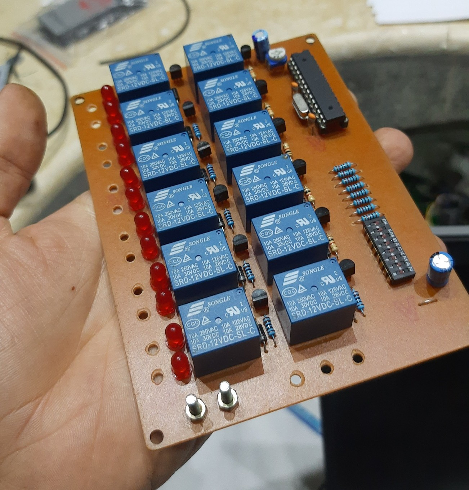

# LED Signs Controller
_A custom controller for LED shop signs using an ATmega 328p. Supports up to 12 relays (12 sign digits) with adjustable switching delay and multiple light patterns._

  

## Overview
This project is an ATmega 328p based controller for shop LED signs.  
It can drive up to 12 digits, with 4 light patterns and adjustable timing between 500 ms and 1 s.   
There are 2 versions: 6-digits and 12-digits.

## Features  
- **Dynamic LED Patterns**: Choose between **4 operation modes**.  
- **Customizable Number of LEDs**: Control **1 to 12 digits** with 4 switches.  
- **Adjustable Delay Times**: Use a potentiometer to select **delay intervals** for dynamic patterns.  
- **Easy Assembly**: Single-layer PCB with mostly THT components and minimal SMD parts.  
- **Flexible Voltage Options**: Operates on **12V or 24V**, depending on your needs.  

---

## Components List  
### Essential Components:  
1. **ATmega328P microcontroller** (with Arduino bootloader).  
2. **THT Relays**: 12V or 24V (depending on configuration).  
3. **Voltage Regulators**: 12V (only for 24V systems), 5V .  
4. **Switches**: 8 pull-up switches for control inputs.  
5. **LED Indicators**: Small LEDs to monitor each output channel.  
6. Resistors, capacitors, transistors, and diodes (standard THT components).  

### Optional Components:  
- **PCB Mask** to add a protection layer to the PCB.  
- **Heat Sink** for voltage regulator (if needed).  

---

## Hardware Overview  
1. **Inputs**:  
   - **Power Supply**: 12V or 24V and GND.  
   - **Control Switches**:  
     - 4 switches for the number of LEDs.  
     - 2 switches for operation modes.  
     - Potentiometer for delay times.  
2. **Outputs**:  
   - 12 or 6 positive outputs (based on the circuit model).  
   - 2-3 common GND pins for all outputs.  
3. **PCB Design**:  
   - Single-layer for easy DIY manufacturing.  
   - THT components for straightforward soldering.  
   - Compact layout with labeled connections.  

---

## Firmware  
The firmware is written on the **Arduino platform** and requires the ATmega328P chip to be bootloaded.  
### Setup:  
1. Burn the **Arduino bootloader** onto the ATmega328P chip.  
2. Open the provided Arduino code in the repository.  
3. Compile and upload the code to the ATmega328P using an **Arduino-compatible programmer**.  

---

## Operation  
### Control Switches  
1. **Number of LEDs (4 switches)**:  
   - Use binary values (e.g., `0000` for 0 LEDs, `0001` for 1 LED, up to `1100` for 12 LEDs).  
2. **Operation Modes (2 switches)**:  
   - `00`: Dynamic Mode 1 (e.g., Sequential Lighting).  
   - `01`: Dynamic Mode 2 (e.g., Blinking All LEDs).  
   - `10`: Dynamic Mode 3 (e.g., Alternate Pairs Lighting).  
   - `11`: Dynamic Mode 4 (e.g., Random LED Lighting).
     
---

### Testing  
After assembling the board:  
1. Set all switches to the maximum values.  
2. Vary the operation mode and delay settings.  
3. Observe LED indicator behavior on each output channel.  

---

## Repository Structure  
- **Hardware:** PCB design files, schematics, KiCad Files, and BOM
- **Firmware:** Arduino firmware and bootloader setup
- **Documentation:** User guides, truth table, and setup instructions
- **Real-Tests:** Images, videos, and reports of real-world tests

---

## Future Plans  
- **Wi-Fi Support** for wireless control.  
- **Mobile App** to customize patterns and delays.  
- **RGB Control** for each digit.  
- **Custom Modes** for user-defined patterns.  

---

## License  
This project is released under the **MIT License**.  

Feel free to contribute, modify, and enhance this project.
